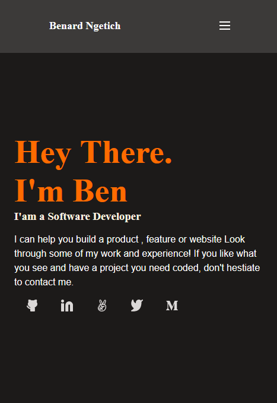
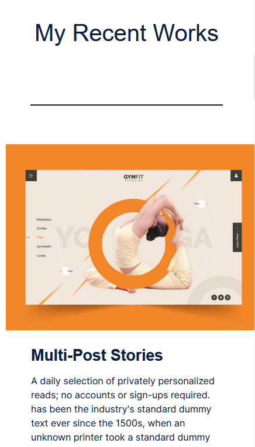
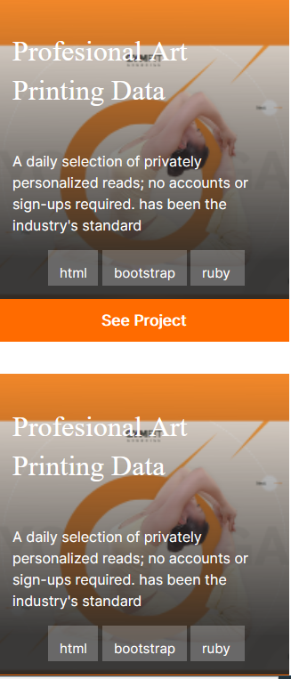

# Project Name

-Portfolio: Portfolio Deploy

# Getting Started
-To get a local copy up and running follow these simple example steps.

## Setup
-To setup the webpage in your local up in the repo page: click on code (dropdown list) > Download as ZIP

# Deployment
 ## Getting Started

To get a local copy up and running follow these simple example steps.

Clone the repo to your local machine.

git clone https://github.com/telanet/My-Portfolio.git

cd My-Portfolio
  
## Built With

- HTML
- CSS

### Prerequisites
-Git
-VS Code
-Linters
-Github pages

## Live Demo
Live site URL to portfolio
[Live Demo Link](https://telanet.github.io/My-Portfolio/)

## Authors

👤 **Author1**

- GitHub: [@telanet](https://github.com/telanet)
- Twitter: [@Ben54647605](https://twitter.com/Ben54647605)

## 🤝 Contributing

This project welcomes contributions.

Feel free to check the [issues page](../../issues/).

## Show your support

Give a ⭐️ if you like this project!

## Acknowledgments

- Hat tip to anyone whose code was used

## 📝 License
MIT